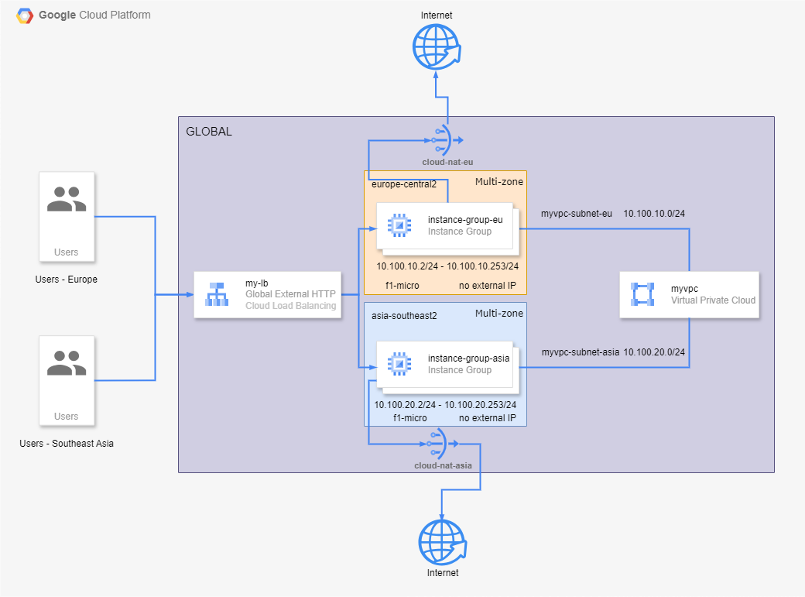

# Terraform Project

## Google Cloud Platform

## Architecture



### Services

- Classic Application External HTTPs Load Balancer
- Managed Instance Group (MIG)
- Custom VPC Network and its subnetworks
- Firewall Rules
- SSL
- IAM custom role

### Enabling Required APIs

To enable the required APIs, you can use the following `gcloud` CLI command:

```sh
gcloud services enable compute.googleapis.com \
  iam.googleapis.com \
  logging.googleapis.com \
  monitoring.googleapis.com \
  cloudresourcemanager.googleapis.com
```

### Or you can add this code to `provider.tf` to enable APIs

```terraform
resource "google_project_service" "services" {
  project                    = var.project_id
  for_each                   = toset(var.services)
  service                    = each.value
  disable_dependent_services = true
}

variable "services" {
  type        = list(string)
  description = "example: ['compute.googleapis.com', 'iam.googleapis.com']"
}
```

### Create `terraform.tfvars` to fill the variables

```terraform
var_1=value
var_2=value
var_3=value
```
